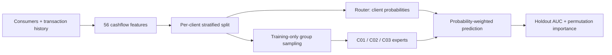

# Cashflow Credit Risk

Credit-risk modeling from transaction histories across three client groups.
A learned LightGBM router combines the predictions of group-specific experts,
using 56 cashflow features to represent income regularity, liquidity trends,
transaction behavior, and frequency-domain patterns.

The repository includes configuration-driven experiments, an explicit feature
catalog, reproducible model artifacts, and a synthetic demo that runs without
access to the original data.

## The approach

- **Soft-routing mixture of experts.** One multiclass LightGBM router learns
  client-group membership from features. Three binary LightGBM experts learn
  within their respective groups; router probabilities weight their predictions.
- **56 cashflow features.** 44 cashflow and trend features, 6 spectral features,
  and 6 behavioral-risk features. The feature catalog is explicit and ordered.
- **Group-specific sampling.** Selected groups use negative downsampling and
  nearest-neighbor interpolation of positive examples. Only the training split
  is resampled; the router sees the original training population.
- **Inspectable evaluation.** Per-client and mean client ROC-AUC, saved split
  assignments and predictions, and optional repeated permutation importance.



The design allows groups to have different decision functions while blending
their predictions for each consumer. Whether this improves on a single
LightGBM requires a controlled real-data comparison; the architecture alone
does not establish a gain. [Methodology and preserved behavior](docs/methodology.md)
explain the training details and evaluation limits.

## Run the demo

Install [uv](https://docs.astral.sh/uv/), then run from the repository root:

```bash
uv sync
uv run cashflow-demo --config configs/demo.yaml
```

This creates 260 synthetic consumers and 24,960 transactions under
`data/staging/demo/`, trains the same model architecture with a small tree budget,
and computes validation permutation importance for three example features.
Generation, feature construction, splitting, training, and evaluation use the
configured seed. Identical existing demo inputs are reused; different existing
data is never overwritten.

All generator settings live in the YAML. The synthetic labels are independent
of the transaction histories, so its AUC is **not a model-quality result**.

## Run with real data

Place the original parquet files in the locations specified by
[`configs/cashflow_moe.yaml`](configs/cashflow_moe.yaml), or copy that configuration
and update its `data` paths. The required columns and transaction sign convention
are documented in [the data contract](docs/data.md).

```bash
uv run cashflow-run --config configs/cashflow_moe.yaml
uv run cashflow-run --config configs/cashflow_moe_importance.yaml
```

The first configuration preserves the original 56-feature model and training
policy. The second uses the same training settings and measures all 56 features
with ten permutations each on the validation split. Historical `v15_4*.yaml`
configurations remain available for reproducibility.

Each run writes an isolated directory:

```text
logs/YYYYMMDD_HHMMSS_<experiment_name>/
  config.yaml                          effective experiment configuration
  source_config.yaml                   original supplied YAML file
  run.log                              execution log
  metadata.json                        code, environment, and input metadata
  metrics.json                         validation and test metrics
  feature_names.json                   ordered model input names
  splits.csv                           consumer-to-split assignments
  models/model.joblib                   fitted router and experts
  predictions/validation_predictions.csv
  predictions/test_predictions.csv
  permutation_importance.json          when enabled
```

Data, predictions, and fitted models are excluded from git. Real-data benchmark
results are not bundled; comparisons should use the same split and training
policy, with the corresponding run artifacts retained.

## Code map

| Location | Responsibility |
|---|---|
| `configs/` | Complete experiment settings and demo generation parameters |
| `src/cashflow_ml/data.py` | Parquet loading, input validation, and splitting |
| `src/cashflow_ml/features/` | Stateless feature families and named feature sets |
| `src/cashflow_ml/models/` | Router/expert model definition and prediction |
| `src/cashflow_ml/sampling.py` | Negative downsampling and positive augmentation |
| `src/cashflow_ml/trainer.py` | Training the router and experts |
| `src/cashflow_ml/evaluations/` | Metrics and permutation importance |
| `src/cashflow_ml/experiment.py` | Compose a run and persist its artifacts |
| `tests/` | Behavioral regression, data boundaries, and pipeline checks |

```bash
uv run pytest
uv run ruff check .
```

[`uv.lock`](uv.lock) pins the environment. See the
[refactor verification](docs/verification.md) for numerical equivalence checks, the
[engineering guide](docs/ML_PROJECT_GUIDE.md) for extension points, the
[methodology](docs/methodology.md) for modeling decisions, and the existing
[feature reference](docs/feature_explanation.md) for feature definitions and
transaction-category mappings.
