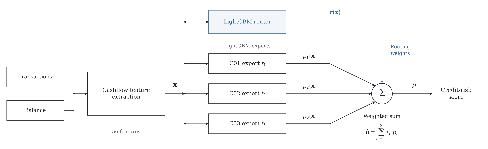

# Cashflow Credit Risk — architecture diagram



[Editable SVG](architecture.svg) · [One-page vector PDF](cashflow-methods.pdf)

## What the diagram shows

Read from left to right: transaction history and consumer balance become a
56-feature vector, shared by a multiclass LightGBM router and three binary
LightGBM experts. Each expert predicts the positive-label probability; the
router produces client-membership probabilities that weight those predictions.
Their weighted sum produces the consumer's credit-risk score.

The figure concentrates on the inference computation. Thin neutral connectors
carry features and expert predictions; muted blue identifies router weights.
Client labels C01, C02, and C03 identify the experts. Training uses these labels
to supervise the router, while inference computes its weights from features.

Feature formulas, sampling ratios, sample weights, split sizes, hyperparameters,
and evaluation settings are documented in the [methodology](../methodology.md)
and [feature reference](../feature_explanation.md). Keeping those details beside
the figure makes the main computation readable at document size. The methodology
also describes omitted-expert renormalization and its numerical denominator floor.

The original dataset is private. This diagram is drawn from the method definition
and contains no consumer records or empirical performance claims.

## Reproduce and edit

Run from the repository root:

```bash
uv sync --group figures
uv run --group figures python scripts/figures/generate.py --config configs/figures/paper.yaml
```

The generator exports `architecture.png`, `architecture.svg`, and the one-page
`cashflow-methods.pdf` in this directory. No dataset, trained model, or prior
experiment run is required. SVG text and shapes remain editable; the PDF retains
vector linework and text.

[`configs/figures/paper.yaml`](../../configs/figures/paper.yaml) controls export
settings. [`scripts/figures/theme.py`](../../scripts/figures/theme.py) defines
typography and colors, and
[`scripts/figures/architecture.py`](../../scripts/figures/architecture.py)
defines the drawing. Edit these sources and regenerate to keep the diagram
reproducible.
